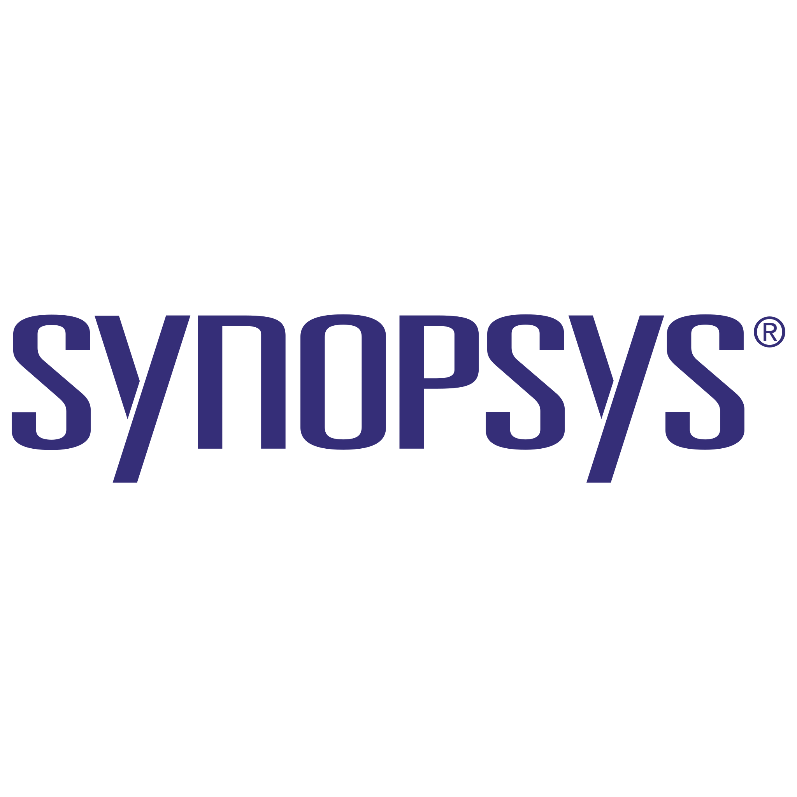
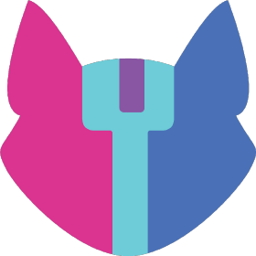
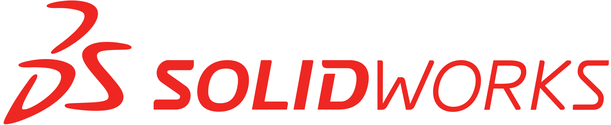

<h1 align="center">Hi there 👋, I'm Usman Siddique</h1>
<h3 align="left">A passionate hardware engineer currently working as an Associate Design Verification Engineer.</h3>

  

<!-- 
 
 
 -->

- 🔭 I’m currently working on [OpenTCAM](https://github.com/merledu/OpenTcam)
- 🌱 I’m currently learning 
- 👯 I’m looking to collaborate on ...
- 🤔 I’m looking for help with ...
- 💬 Ask me about ...
- 📫 How to reach me: ...

- 👨‍💻 All of my projects are available [here](https://github.com/usman1515?tab=repositories).

<h3 align="left">Connect with me:</h3>

<!--  -->

 

<h3 align="left">Programming Languages:</h3>

 
<!-- Verilog • SystemVerilog • UVM • -->
<!-- Verilog -->
<!-- SystemVerilog -->
<!-- UVM -->

 

 
 

 

<h3 align="left">Tools and Technologies:</h3>

<!-- ModelSim -->

<!-- Synopsys SpyGlass -->

<!-- OpenLane -->
<!-- AVR MCUs -->
<!-- ESP-8266/ESP-32 -->
<!-- Altium Designer -->
<!-- KiCAD -->
<!-- 3D printing -->
<!-- Atmel Studio -->
<!-- Platform IO -->
 
<!-- MATLAB -->

<!-- SimuLink -->

<!-- Familiar: -->
<!-- Xilinx ISE Design suite -->
<!-- Intel Quartus -->

<!--  -->

&nbsp;

